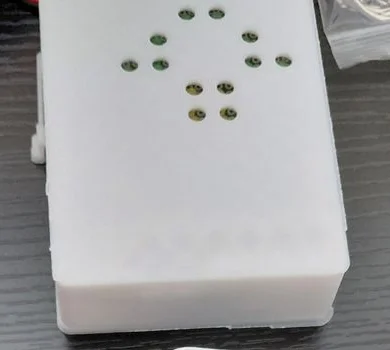
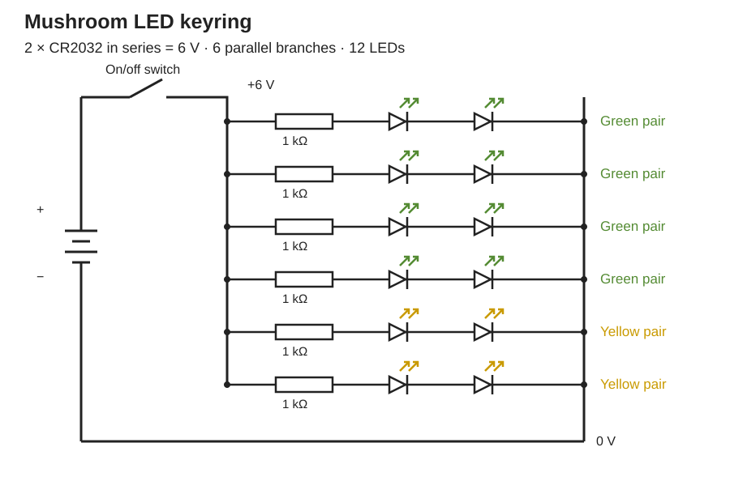

# Mushroom LED Keyring

> Twelve LEDs, two coin cells and a switch, inside a 3D-printed mushroom keyring.

The original circuit began as an early soldering project. I later designed and printed the enclosure
for Liverpool MakeFest 2026.

[][yt]
[][tt]
[][ig]

  
  

## What it does

Eight green LEDs form the cap and four yellow LEDs form the stem. Slide the switch to light all twelve. No code or microcontroller is needed.

## Circuit

[Open the circuit in Tinkercad][tinkercad].

## Bill of materials

| Qty | Component | Part | Unit cost | Notes |
| --- | --- | --- | --- | --- |
| 2 | Coin cell | CR2032 3 V | £0.60 | Wired in series for 6 V |
| 2 | Battery holder | CR2032 holder | £0.40 | Or one 2-cell holder |
| 1 | Slide switch | SPDT | Not recorded | On/off, in the positive line |
| 12 | LED | 5 mm | from kit | 8 green, 4 yellow |
| 6 | Resistor | 1 kΩ | from kit | One per pair of LEDs |
| 1 | Mini solderable breadboard | | £0.67 | Unit from 12-pack |
| 1 | Keyring hardware | Split ring | £0.30 | |
| 44.79 g | Printed enclosure | PLA | £1.57 total | Slicer estimate, including brims |

**Recorded parts and enclosure: about £4.53**, excluding the switch and shared LED/resistor kit. Prices use per-part costs from purchased packs; PLA is £0.035/g.

## Wiring

Two cells in series supply 6 V. The six LED pairs connect in parallel, with the switch in battery positive.

| From | To | Notes |
| --- | --- | --- |
| Cell 1 | Cell 2 | In series, 6 V total |
| Battery + | Slide switch | Switch breaks the positive line |
| Slide switch | + rail | |
| Battery - | - rail | |
| + rail | Resistor (×6) | One resistor per branch |
| Resistor | First LED anode | |
| First LED cathode | Second LED anode | Two LEDs in series per branch |
| Second LED cathode | - rail | |

## Assembly

1. Fit the LEDs to the shell openings: eight green in the cap, four yellow in the stem.
2. Solder six branches, each with a 1 kΩ resistor and two LEDs in series.
3. Connect the branches across the rails; wire the switch into battery positive.
4. Check polarity and continuity before fitting the cells, then close the rear cover.

## Printed enclosure

[Download the shell and rear cover](print/mushroom-enclosure.3mf).

Bambu Lab P1S, 0.4 mm nozzle, PLA, 0.2 mm layers, two walls, 15% infill. Shell LED-face down; cover exterior down. The project includes 3 mm brims and no supports. Check your printer profile and re-slice.

The [Onshape source document][onshape] contains the enclosure design history and named revisions.

## Mushroom inspiration

The green cap and yellow stem resemble the Jelly Babies mushroom, *Leotia viscosa*.

  

[Leotia viscosa][jelly-babies] by Alex Abair, [CC BY 4.0][cc-by].

## This project elsewhere

| Where | Link | What is there |
| --- | --- | --- |
| Portfolio | [Read the project page][portfolio] | Full build overview |
| Tinkercad | [Open the circuit][tinkercad] | Original circuit design |
| Onshape | [Open the enclosure source][onshape] | Enclosure design history and named revisions |
| YouTube | [Watch the build][yt-1] | Original soldering build |
| TikTok | [Watch the build][tt-1] | Original soldering build |
| Instagram | [Watch the build][ig-1] | Original soldering build |

## Licences

- Software and firmware: [MIT](LICENSE)
- Original enclosure, circuit diagram, build documentation and released project photographs: [CC BY-NC-SA 4.0](LICENSE)
- *Leotia viscosa* reference photograph by Alex Abair: [CC BY 4.0][cc-by]

---

All projects at [github.com/TikitaTolley][gh].

[yt]: https://youtube.com/@tikitatech
[tt]: https://tiktok.com/@tikitatech
[ig]: https://instagram.com/tikitatech
[gh]: https://github.com/TikitaTolley
[portfolio]: https://tikitatech.xyz/projects/mushroom-led-keyring/
[tinkercad]: https://www.tinkercad.com/things/bni5gjmEZWk-mushroom-leds
[onshape]: https://cad.onshape.com/documents/bb2d524031b677eb6eb5ac94/w/c66be54d3ab91841cf2fdc67/e/091ab4f1d0745a42349ae6d5

[yt-1]: https://www.youtube.com/shorts/RpJ-dfvH-7w
[tt-1]: https://www.tiktok.com/@tikitatech/video/7672160859707247894
[ig-1]: https://www.instagram.com/reel/Db1ftWJq4Ef/

[jelly-babies]: https://commons.wikimedia.org/wiki/File:Leotia_viscosa_539279562.jpg
[cc-by]: https://creativecommons.org/licenses/by/4.0/
