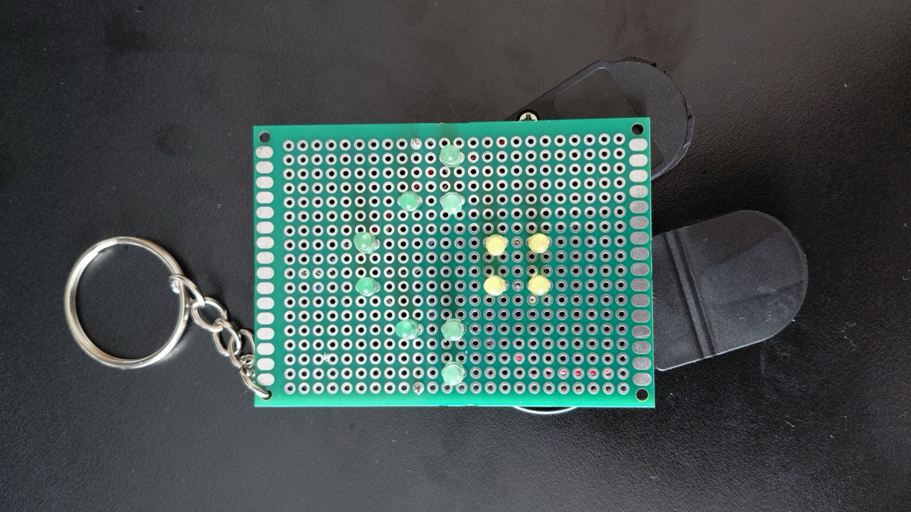
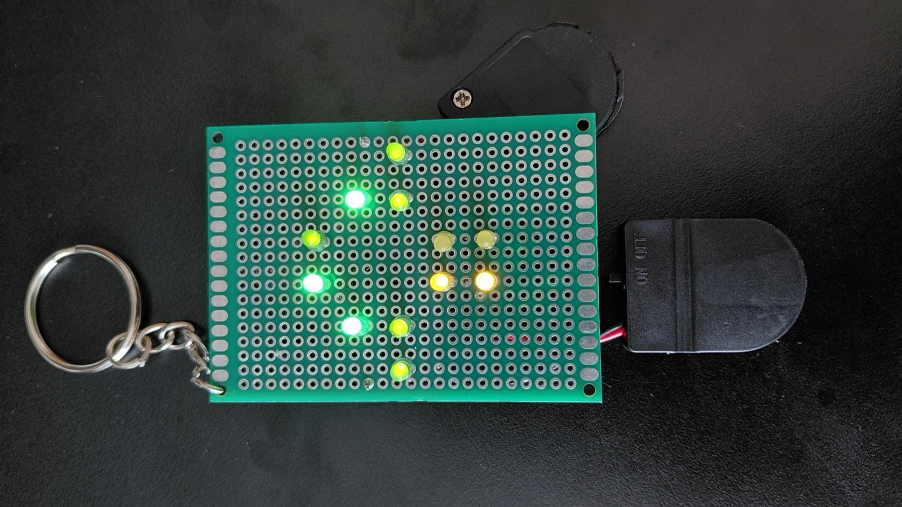
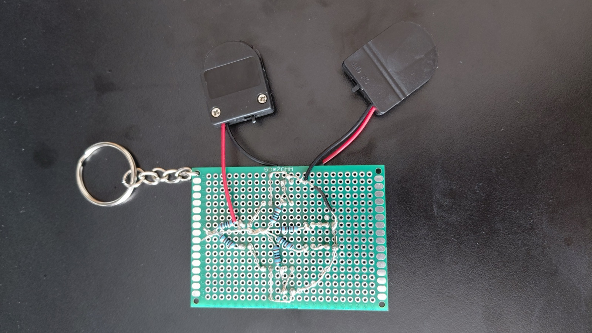
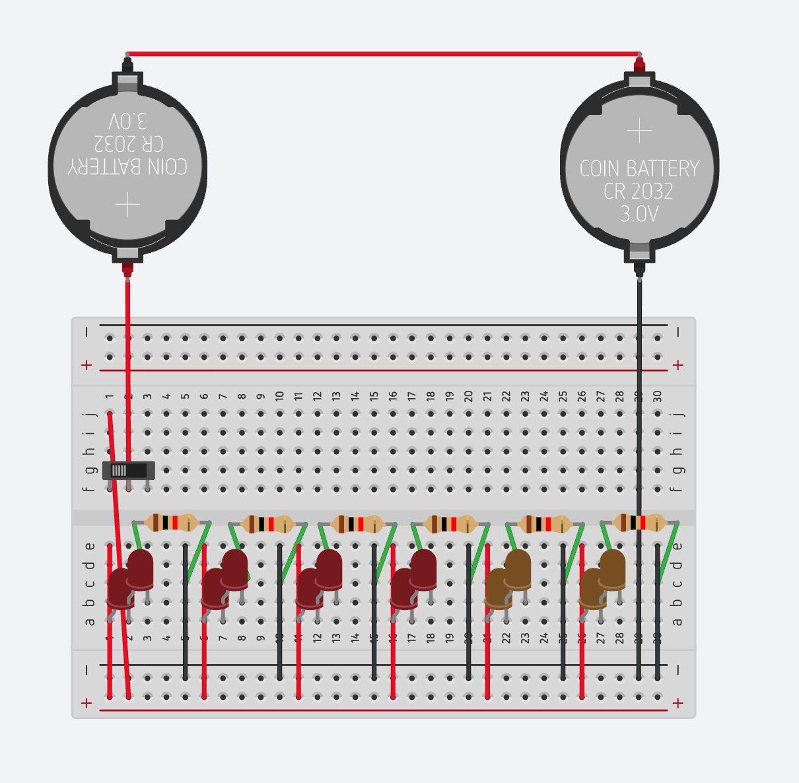

# Mushroom LED Keyring

> A keyring of LEDs arranged in a mushroom cap, switched on and off by a slide switch.

[][yt]
[][tt]
[][ig]
[][tinkercad]

  
  
  

## What it does

Green and yellow LEDs laid out as a mushroom cap, running off coin cells with a slide switch for on/off. The LEDs go two in series behind a single resistor, and those six pairs sit in parallel across the rails, so they all light together and a dead LED only takes its own pair out.

## Simulated Circuit

  

| Sim | Link | Notes |
| --- | --- | --- |
| Tinkercad | [Open][tinkercad] | Breadboard version of the circuit, 14 LEDs (10 red, 4 yellow) |

## Bill of materials

| Qty | Component | Part | Unit cost | Notes |
| --- | --- | --- | --- | --- |
| 2 | Coin cell | CR2032 3 V | £0.60 | Wired in series for 6 V |
| 2 | Battery holder | CR2032 holder | £0.40 | Or one 2-cell holder |
| 1 | Slide switch | SPDT | TBD | On/off, in the positive line |
| 12 | LED | 5 mm | from kit | 8 green, 4 yellow |
| 6 | Resistor | 1 kΩ | from kit | One per pair of LEDs |
| 1 | Mini solderable breadboard | | £1.50 | |
| 1 | Keyring hardware | Split ring | £0.30 | |

**Total: £3.80** for the parts bought, plus the slide switch.

## Wiring

Two CR2032 cells in series give 6 V across the breadboard rails. The slide switch sits in the positive line, so it cuts power to everything. Each branch is one resistor and two LEDs in series, from the positive rail to ground, with the six branches in parallel.

| From | To | Notes |
| --- | --- | --- |
| Cell 1 | Cell 2 | In series, 6 V total |
| Battery + | Slide switch | Switch breaks the positive line |
| Slide switch | + rail | |
| Battery - | - rail | |
| + rail | Resistor (×6) | One resistor per branch |
| Resistor | First LED anode | |
| First LED cathode | Second LED anode | Two LEDs in series per branch |
| Second LED cathode | - rail | |

## Notes

Even though it doesn't look like a typical mushroom, there turns out to be a green cap and yellow stem mushroom out there!
It's called the Jelly Babies (Leotia viscosa) mushroom.

  

[Leotia viscosa][chicken-lips] by Alex Abair, [CC BY 4.0][cc-by].

## Licence

MIT, see [LICENSE](LICENSE).

---

This build on [YouTube][yt-1] · [TikTok][tt-1] · [Instagram][ig-1]. All projects at [github.com/TikitaTolley][gh].

[yt]: https://youtube.com/@tikitatech
[tt]: https://tiktok.com/@tikitatech
[ig]: https://instagram.com/tikitatech
[gh]: https://github.com/TikitaTolley

[yt-1]: https://www.youtube.com/shorts/RpJ-dfvH-7w
[tt-1]: https://www.tiktok.com/@tikitatech/video/7672160859707247894
[ig-1]: https://www.instagram.com/reel/Db1ftWJq4Ef/
[tinkercad]: https://www.tinkercad.com/things/bni5gjmEZWk-mushroom-leds

[jelly-babies]: https://commons.wikimedia.org/wiki/File:Leotia_viscosa_539279562.jpg
[cc-by]: https://creativecommons.org/licenses/by/4.0/
